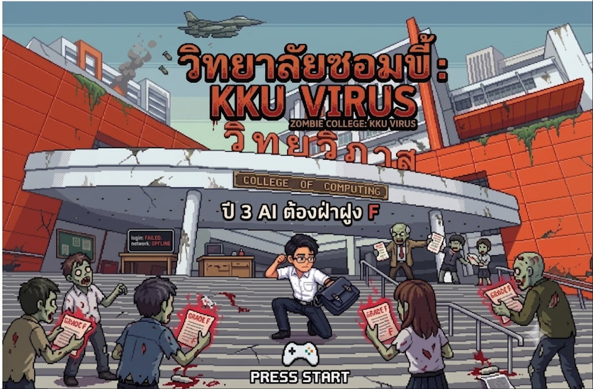
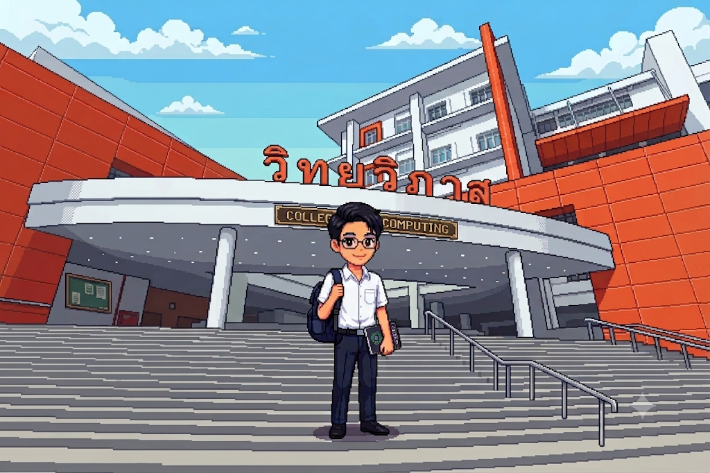
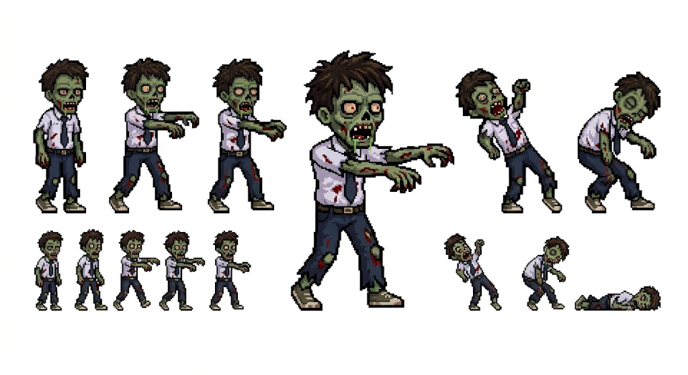
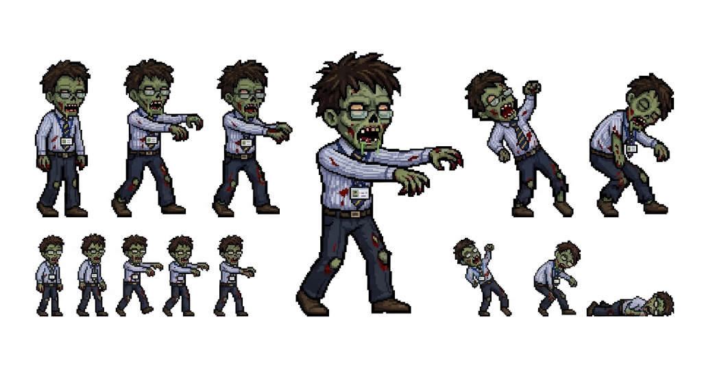
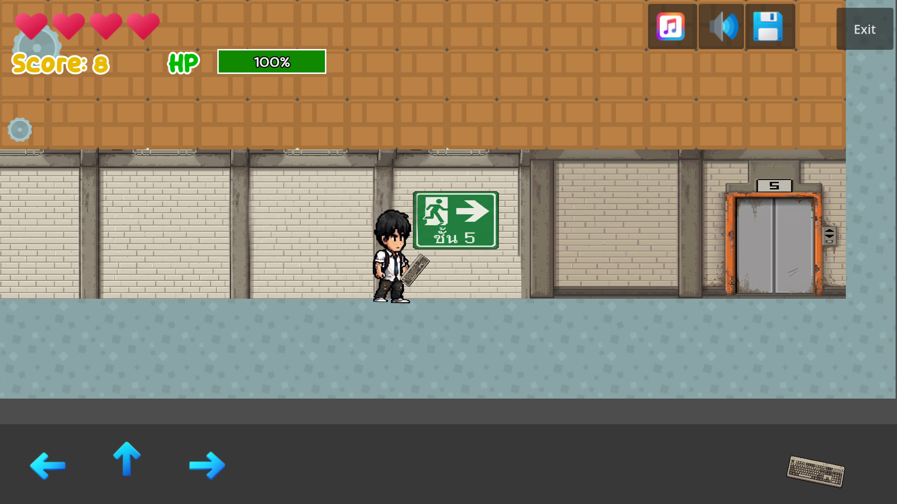

# วิทยาลัยซอมบี้: KKU VIRUS
test
**Zombie College: KKU VIRUS** — เกม 2D Platform แนว Survival/Zombie พัฒนาเป็นส่วนหนึ่งของวิชา Computer Game Development วิทยาลัยการคอมพิวเตอร์ มหาวิทยาลัยขอนแก่น

ภาคการศึกษาต้น ปีการศึกษา 2569 · กลุ่มที่ 6

## Preview

> ปี 3 AI ต้องฝ่าฝูง F

## เนื้อเรื่องย่อ

สมเด็จเป็นนักศึกษามหาวิทยาลัยขอนแก่น คณะวิทยาลัยการคอม สาขา AI ชั้นปีที่ 3 ใช้ชีวิตตามปกติ จนกระทั่งวันหนึ่งอาจารย์คณะวิทยาศาสตร์ทำการทดลองไวรัสชื่อ `kku virus` โดยมีเป้าหมายให้นักศึกษาสามารถอ่านเปเปอร์ได้ทั้งวันโดยไม่หยุดพัก แต่มีนักศึกษาแอบนำอาหารเข้าห้องแล็บและทำเศษอาหารหล่นลงหลอดทดลอง ทำให้ไวรัสปนเปื้อนและกลายพันธุ์

อาจารย์ที่ไม่รู้เรื่องทดลองกับตัวเองจนกลายเป็นซอมบี้ แล้วแพร่เชื้อต่อไปเรื่อย ๆ จนลามไปทั้งคณะ ส่วนสมเด็จตื่นสายและไม่ได้ล็อกอิน `kku.net` จึงไม่รู้เรื่องการระบาด เมื่อขับรถเข้ามาเรียนตามปกติ ก็พบว่าตัวเองติดอยู่ในตึกที่เต็มไปด้วยซอมบี้ และต้องพยายามฝ่าวงล้อมซอมบี้ออกไปให้ได้ก่อนที่ทหารจะเข้ามาทิ้งระเบิดกวาดล้าง

## ตัวละคร

### Samdech (สมเด็จ)
นักศึกษามหาวิทยาลัยขอนแก่น คณะวิทยาลัยการคอม สาขา AI ชั้นปีที่ 3 ผู้ตื่นสายและต้องเอาชีวิตรอดจากซอมบี้

### ซอมบี้นักศึกษา
นักศึกษาผู้โชคร้ายที่ติด `kku virus` — โจมตีระยะใกล้

### บอสซอมบี้อาจารย์
อาจารย์ผู้ไม่รู้เรื่องและทดลองกับตัวเองจนกลายเป็นซอมบี้ — โจมตีระยะไกล ทำให้ผู้เล่นติดสถานะ F (เดินช้าลงและเสียพลังชีวิตต่อเนื่อง)

## รูปแบบการเล่นและกติกา

- **รูปแบบเกม**: 2D Platform — ผู้เล่นควบคุมการวิ่ง กระโดด และต่อสู้กับซอมบี้เพื่อเอาชีวิตรอด
- **เป้าหมาย**: จัดการกับซอมบี้ในแต่ละชั้นเพื่อผ่านด่าน
- **ระบบนับเวลาถอยหลัง**: ผู้เล่นต้องทำภารกิจให้เสร็จภายในเวลาที่กำหนด หากไม่ทันจะแพ้ (Game Over)

### การโจมตีของซอมบี้
| ประเภท | รูปแบบการโจมตี | ผลกระทบ |
|---|---|---|
| ชนโดยตรง | ระยะประชิด | พลังชีวิตลดลง |
| ซอมบี้นักศึกษา | ระยะใกล้ | พลังชีวิตลดลง |
| ซอมบี้อาจารย์ | ระยะไกล | ติดสถานะ F (เดินช้าลง + เสียพลังชีวิตต่อเนื่อง) |

### ระบบไอเทม
ผู้เล่นสามารถเก็บไอเทมต่าง ๆ เพื่อใช้โจมตีซอมบี้หรือฟื้นฟูพลังชีวิต โดยต้องเลือกใช้ให้เหมาะกับสถานการณ์:

- **คีย์บอร์ด** — โจมตีระยะประชิด (ใช้เยอะระวังพัง)
- **เมาส์** — โจมตีระยะไกล ใช้ได้ไม่จำกัด
- **ขวดน้ำ** — เพิ่มพลังชีวิต

### ด่านและความยาก
| ชั้น | ความยาก |
|---|---|
| ชั้น 1 | ซอมบี้อาจารย์ + ซอมบี้นักศึกษา ปริมาณเยอะมาก |
| ชั้น 2 | ซอมบี้อาจารย์ + ซอมบี้นักศึกษา จำนวนพอ ๆ กับชั้น 4 |
| ชั้น 3 | มีแต่ซอมบี้อาจารย์ |
| ชั้น 4 | ซอมบี้มากกว่าชั้น 5 แต่ยังไม่มีซอมบี้อาจารย์ |
| ชั้น 5 | ซอมบี้ออกมาจำนวนไม่มาก |

## แนวคิดการออกแบบ

**กราฟิก**
- สไตล์ไทย — ใช้สีสันหม่นหมอง ตัวละครและฉากออกแบบให้มีเอกลักษณ์
- 2D Pixel Art — ให้ความรู้สึกคลาสสิกผสมผสานความทันสมัย
- ฉากหลากหลาย แตกต่างกันในแต่ละชั้น

**เสียง**
- เพลงประกอบแนวสยองขวัญ ผสมผสานดนตรีสมัยใหม่
- เสียงเอฟเฟกต์: เสียงธรรมชาติ เสียงซอมบี้ เสียงเครื่องบินทิ้งระเบิด
- พากย์เสียงภาษาไทยเพื่อเพิ่มอรรถรสและความสมจริง

**Level Assets**

**เกมที่คล้ายกัน**: Contra

## การวิเคราะห์ความสนุกของเกม (AGE Analysis)

### แรงจูงใจในการเล่น
- **การเอาชีวิตรอด** — การโจมตีของซอมบี้ ระบบนับเวลาถอยหลัง
- **อยากสวมบทบาท** — รับบทตัวละครนักศึกษาที่ต้องเอาตัวรอด
- **สะสมสิ่งของ / ความโลภ** — ระบบไอเทม
- **การปกป้อง** — ช่วยกำจัดซอมบี้ รักษาไม่ให้ติดเกรด F
- **การสื่อสาร** — ระบบอินเทอร์เน็ตในเกม
- **ชอบสีสัน** — ฉากและตัวละครโทนมืดมน เหมาะกับผู้ชอบยิงซอมบี้
- **สำรวจ** — มีด่านที่หลากหลาย
- **ก้าวร้าว** — ระบบต่อสู้กำจัดซอมบี้
- **ความแค้น** — "แค้นฝัง F": ความกดดันจากการเรียน ความกลัวสอบตก และความรู้สึกล้มเหลวจากเกรด F ที่กลายเป็นแรงขับให้ซอมบี้ไล่ล่าสมเด็จ
- **แข่งขัน** — ระบบเวลา

## จัดทำโดย

กลุ่มที่ 6 · วิชา Computer Game Development CP410844
วิทยาลัยการคอมพิวเตอร์ มหาวิทยาลัยขอนแก่น

1. 673380354-9 นายอภิมุข เพียสักขา
2. 673380076-1 นายณภัทร โสดาดง
3. 673380309-4 นายจักรภัทร เอี่ยมเสริม
4. 673380358-1 นางสาวเตชินี ถามูลตรี
